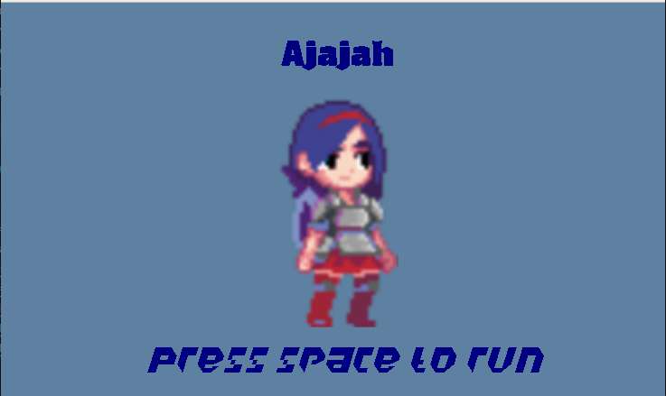
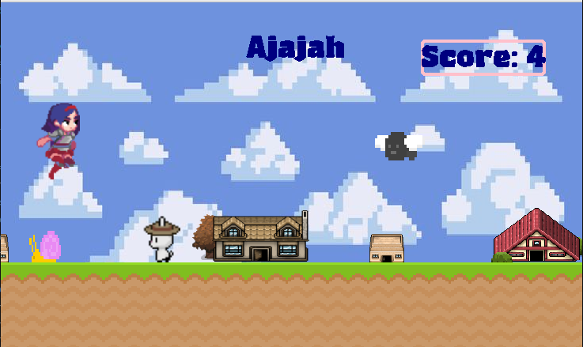

# Ajajah


**Ajajah** is a classic 2D platformer game developed in Python using Pygame. The game features a player character navigating through obstacles while running, jumping, and avoiding collisions.  



---

## Features

- Smooth 2D platformer gameplay
- Animated player and obstacles
- Multiple background elements (houses, sky, ground)
- Score tracking based on survival time
- Customizable player and obstacle sprites
- Audio feedback for jumps and actions



---

## Installation

### Requirements

- Python 3.12+
- Pygame 2.6.1 (or Pygame‑CE if adapting for browser/Web)
- Optional: PyInstaller for creating standalone executables

### Running from Source

1. Clone or download the repository:

```bash
git clone https://github.com/rihemkhammar/Ajajah_2D_game
cd Ajajah_2D_game
